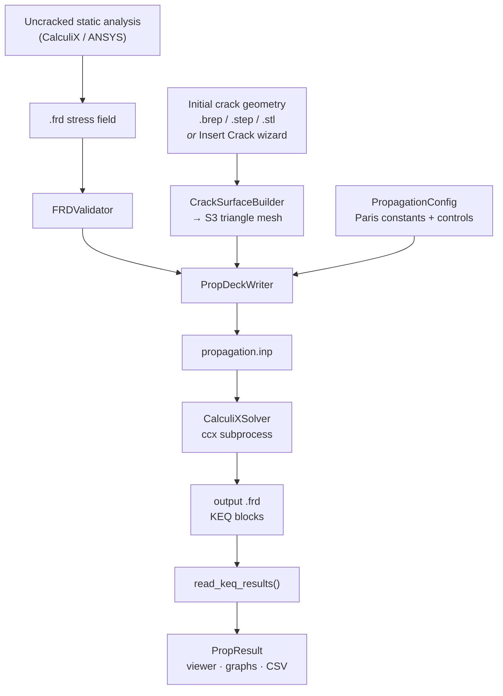

# GmCrackX

**A CalculiX `*CRACK PROPAGATION` frontend — prepare, run, read and visualize 3-D fatigue crack growth.**

GmCrackX is a PyQt6 desktop application that wraps the crack-propagation
capability built into [CalculiX](http://www.calculix.de/) (CrunchiX, §6.9.27).
You supply a stress field from an already-solved *uncracked* static analysis
and an initial crack surface; GmCrackX builds the S3 crack mesh, writes a
self-contained propagation input deck, runs the solver, and post-processes the
KEQ output — crack front evolution, ΔK<sub>eq</sub>, da/dN, cycles and crack
length — in an interactive 3-D viewer.

> **Design decision:** GmCrackX does **not** solve the initial static analysis,
> and it does **not** re-implement fracture mechanics. CalculiX owns all the
> physics; GmCrackX owns model preparation, orchestration and post-processing.

---

## Table of contents

- [Concept](#concept)
- [Features](#features)
- [How it works](#how-it-works)
- [Requirements](#requirements)
- [Installation](#installation)
- [Configuring the CalculiX solver](#configuring-the-calculix-solver)
- [Quick start — GUI](#quick-start--gui)
- [Quick start — Python API](#quick-start--python-api)
- [Configuration reference](#configuration-reference)
- [Results](#results)
- [Importing results from other solvers](#importing-results-from-other-solvers)
- [Project layout](#project-layout)
- [Module guide](#module-guide)
- [Testing](#testing)
- [Known limitations](#known-limitations)
- [References](#references)
- [License](#license)

---

## Concept

Classical crack-growth frameworks re-mesh the solid at every increment. CalculiX
takes a different route: the crack is described by a **shell mesh of S3
(3-node triangle) elements** laid over an existing volume mesh, and the solver
advances the crack front internally using a Paris-type law. The crack front is
detected automatically as the set of *free edges* of the shell mesh — edges
belonging to exactly one S3 element — so no `ELSET` or `*SURFACE` definition
for the front is required.

That makes the user contract very small:

| You provide | GmCrackX produces |
|---|---|
| `.frd` stress results of the **uncracked** structure | S3 crack surface mesh (`crack_surface.inp`) |
| Initial crack geometry (`.brep`, `.step`/`.stp`, `.iges`/`.igs`, `.stl`) — or a parametric crack from the wizard | Self-contained `*CRACK PROPAGATION` deck (`propagation.inp`) |
| Paris constants + propagation controls | CalculiX run + parsed KEQ results + 3-D visualisation |

The volume mesh is read straight out of the FRD file's `2C` (nodes) and `3C`
(elements) sections, so **no reference `.inp` is needed** — the FRD alone fully
defines the structure.

---

## Features

**Model preparation**
- Load and validate a user-supplied FRD stress field (7 hard/soft validation rules: readability, STRESS block presence, finite values, node-count, node-ID and bounding-box consistency, sane von-Mises magnitude).
- Load an initial crack surface from B-rep, STEP, IGES or STL. OpenCASCADE geometry is triangulated through Gmsh with linear + angular deflection control.
- **Insert Crack wizard** for parametric cracks — elliptical/surface, corner, edge, through, or user-defined-from-file — with placement (translate + XYZ-Euler rotation), meshing template, and a live 3-D preview.
- Interactive crack transform dialog (preview → apply → cancel) for repositioning an already-loaded crack.
- Consistent triangle-normal orientation via a BFS pass, seeded from an optional `normal_hint` vector.

**Solving**
- Automatic generation of a complete propagation deck: `*NODE`, `*ELEMENT` (volume + `S3` shell), `CRACK_FRONT` node set, `*MATERIAL`/`*ELASTIC`, `*USER MATERIAL, CONSTANTS=8`, `*SOLID SECTION`, `*SHELL SECTION`, `*STEP, INC=…`, `*CRACK PROPAGATION` and `*NODE FILE / KEQ`.
- Crack-surface node IDs are automatically offset above the volume-mesh IDs — no collisions.
- CalculiX executed as a subprocess with `OMP_NUM_THREADS` control; stdout captured for diagnostics.
- Long-running work runs on a `QThread` worker with progress callbacks, so the UI stays responsive.

**Post-processing**
- VTK/OpenCASCADE-backed 3-D viewer: geometry / mesh / crack visibility toggles, wireframe / surface / surface-with-edges render modes, camera presets (fit, reset, front, top, right, isometric).
- Contour plots of every KEQ quantity, per increment, with auto or global colour range and a toggleable scalar bar.
- Crack front polyline overlay and step-by-step crack advance.
- Increment table, X-Y graphs, animation across increments (with save-to-file), and a point probe.
- CSV and image export.

**Interoperability**
- ANSYS `.rst` → CalculiX `.frd` converter (`Tools ▸ Convert`), so an ANSYS Mechanical static run can feed the propagation pipeline directly.

---

## How it works



`PropRunner.run()` executes this as a single pass with progress reporting:

| % | Stage |
|---|---|
| 5 | Validate configuration (paths, 8 Paris constants, `max_da`, `max_angle`, `length_type`) |
| 15–30 | Build S3 crack surface, write `crack_surface.inp` |
| 40–50 | Write the propagation deck |
| 55–80 | Run CalculiX |
| 80–100 | Parse KEQ increments, report final crack length |

The run ends with `status` set to one of `success`, `ccx_error`, `no_results`,
or `not_run`.

---

## Requirements

| Component | Version | Needed for |
|---|---|---|
| Python | ≥ 3.11 | everything |
| NumPy | any recent | core data structures |
| SciPy | any recent | KD-tree front ordering |
| PyQt6 | ≥ 6.6 | GUI |
| VTK | ≥ 9.3 | 3-D viewer, FRD→VTK conversion |
| PyVista | any recent | mesh helpers used by the converter |
| Gmsh (Python API) | any recent | triangulating B-rep / STEP crack surfaces |
| pythonocc-core | any recent | OCCT geometry loading and display |
| CalculiX (`ccx`) | with crack-propagation support | solving |
| ansys-mapdl-reader | optional | ANSYS `.rst` import |
| pytest | optional | test suite |

STL crack surfaces are loaded directly and need neither Gmsh nor OpenCASCADE.

---

## Installation

### Conda (recommended — matches `run.bat`)

```bash
conda env create -f environment.yml
```

```bash
conda activate gmcrackx
```

The bundled `environment.yml` installs Python 3.11, NumPy, SciPy, PyQt6, VTK,
PyVista and pytest. Add the geometry stack from conda-forge:

```bash
conda install -c conda-forge pythonocc-core python-gmsh
```

Optional — ANSYS RST import:

```bash
pip install ansys-mapdl-reader
```

### Extras declared in `pyproject.toml`

| Extra | Pulls in |
|---|---|
| `brep` | `pythonocc-core` |
| `viz` | `pyvista`, `vtk` |
| `ui` | `PyQt6>=6.6` |
| `full` | all of the above |
| `test` | `pytest` |

Note that `pythonocc-core` is not distributed on PyPI — install it with conda
even if you use pip for the rest.

### Launching

On Windows, `run.bat` activates the `gmcrackx` conda environment and starts the
app. Otherwise:

```bash
python main.py
```

---

## Configuring the CalculiX solver

`PropagationConfig.ccx_path` currently defaults to a machine-specific absolute
path (`CalculixSolver/ccx_dynamic.exe` under the original author's checkout),
and the `CalculixSolver/` directory is git-ignored. **Set this explicitly** for
your machine — either point it at your `ccx` binary or, if `ccx` is on `PATH`:

```python
config = PropagationConfig(ccx_path="ccx", ...)
```

`CalculiXSolver.is_available()` reports whether the configured executable
resolves, either as a full path or via `PATH`.

---

## Quick start — GUI

1. **File ▸ Load FRD** — select the FRD from your uncracked static analysis. The
   validator runs immediately; the volume mesh appears in the viewer and the
   node/element counts show up in the property browser.
2. **File ▸ Load Crack**, or **Home ▸ Insert** to build a parametric crack in
   the wizard. The S3 surface is triangulated and drawn over the model; vertex,
   triangle and crack-front-node counts are reported.
3. **Home ▸ Material** — edit the eight Paris constants in the property browser.
4. **Home ▸ Steps** — set max increment, max deflection angle, increment count
   and length type.
5. **Home ▸ ▶ Run** — the deck is written, CalculiX runs on a background thread,
   and results populate the model tree under *Steps* and *Results*.
6. **Result tab** — show contours, plot the crack front, open graphs, animate
   the increments, probe values, or export CSV / images.

The property browser is the single editing surface; its categories are `FRD`,
`Mesh`, `Crack Surface`, `Material`, `Controls` and `Results`.

A ready-made example lives in `tests/example/ex-1/` — `masterII.frd` (stress
field) plus `crack_surface.stp` (initial crack), together with the reference
deck `crackIIcum.inp`.

---

## Quick start — Python API

```python
from pipeline.prop_config import PropagationConfig
from pipeline.prop_runner import PropRunner

config = PropagationConfig(
    uncracked_frd="tests/example/ex-1/masterII.frd",
    initial_crack="tests/example/ex-1/crack_surface.stp",

    # Structural elastic material (volume + crack shell section)
    structural_material_name="CT3D_BENCHMARK",
    structural_elastic_E=210000.0,
    structural_elastic_nu=0.3,

    # Paris law — *USER MATERIAL, CONSTANTS=8
    paris_constants=(1e-4, 772.86, 3.1, 10.0, 177.09, 10.0, 3162.0, 0.5),

    # Propagation controls
    max_da=0.05,
    max_angle=10.0,
    max_increments=50,
    length_type="CUMULATIVE",

    # Crack surface meshing
    crack_mesh_size=0.05,
    crack_angular_deflection=0.08,
    normal_hint=(0, 0, 1),

    work_dir="./prop_work",
    ccx_path="ccx",
    n_cpus=4,
)

result = PropRunner(config).run(
    progress_cb=lambda pct, msg: print(f"[{pct:3d}%] {msg}")
)

print(result.status)                # success | ccx_error | no_results
print(result.n_increments)          # number of propagation increments
print(result.final_crack_length)    # CRLENGTH from the last increment
print(result.output_frd_path)       # CalculiX output FRD
print(result.deck_path)             # generated propagation deck
```

Lower-level building blocks can be used on their own:

```python
from core.crack_surface_s3 import CrackSurfaceBuilder
from crack_io.frd_validator import FRDValidator
from crack_io.frd_reader import read_frd, read_keq_results
from crack_io.inp_parser import parse_inp
from crack_io.inp_writer import write_inp

state = CrackSurfaceBuilder("crack.stp", mesh_size=0.05).build()
CrackSurfaceBuilder.write_s3_inp(state, "crack_surface.inp")

report = FRDValidator().validate("masterII.frd")
increments = read_keq_results("propagation.frd")
mesh = parse_inp("model.inp")
```

---

## Configuration reference

`PropagationConfig` (`pipeline/prop_config.py`) is the complete user contract.

### Required inputs

| Field | Default | Meaning |
|---|---|---|
| `uncracked_frd` | `""` | FRD of the uncracked structure; must contain a STRESS block. Written as `INPUT=` on `*CRACK PROPAGATION`. |
| `initial_crack` | `""` | Initial crack geometry. Must be a simply-connected surface (topological disk). |

### Structural material

| Field | Default | Meaning |
|---|---|---|
| `structural_material_name` | `"CT3D_BENCHMARK"` | Name for `*MATERIAL,NAME=`, used by both `*SOLID SECTION` and `*SHELL SECTION`. |
| `structural_elastic_E` | `210000.0` | Young's modulus (default: structural steel, MPa). |
| `structural_elastic_nu` | `0.3` | Poisson ratio. |

### Paris law — `*USER MATERIAL, CONSTANTS=8`

`paris_constants` is passed verbatim to CalculiX in this order:

| # | Symbol | Meaning | Default |
|---|---|---|---|
| 0 | (da/dN)<sub>ref</sub> | reference crack growth rate [L/cycle] | `1e-4` |
| 1 | ΔK<sub>ref</sub> | reference stress intensity range [F/L^(3/2)] | `772.86` |
| 2 | m | Paris exponent | `3.1` |
| 3 | ε | threshold correction exponent | `10.0` |
| 4 | ΔK<sub>th</sub> | threshold stress intensity range | `177.09` |
| 5 | δ | critical correction exponent | `10.0` |
| 6 | K<sub>c</sub> | fracture toughness | `3162.0` |
| 7 | w | R-ratio exponent | `0.5` |

> ⚠️ **Units are on you.** They must be consistent with the stress field in
> `uncracked_frd`. CalculiX performs no unit checking.

### Propagation controls

| Field | Default | Meaning |
|---|---|---|
| `max_da` | `0.05` | Max crack increment per CalculiX increment (first value under `*CRACK PROPAGATION`). |
| `max_angle` | `10.0` | Max deflection angle per increment, degrees. Must be in (0, 90]. |
| `max_increments` | `50` | `*STEP, INC=` — number of propagation increments. |
| `length_type` | `"CUMULATIVE"` | `LENGTH=` option; `CUMULATIVE` or `INTERSECTION`. |

### Crack surface meshing

| Field | Default | Meaning |
|---|---|---|
| `crack_mesh_size` | `0.05` | Target linear deflection for triangulation — smaller = finer front, slower. |
| `crack_angular_deflection` | `0.08` | Angular deflection [rad]; controls curvature-driven refinement. |
| `normal_hint` | `None` | Optional unit 3-tuple giving the expected crack normal (e.g. `(0, 0, 1)`), used to seed normal orientation. |
| `shell_thickness` | `0.01` | `*SHELL SECTION` thickness. Required by CalculiX but unused by the propagation physics. |

### Run control

| Field | Default | Meaning |
|---|---|---|
| `material_name` | `"CRACK"` | Name for the `*USER MATERIAL` block and `MATERIAL=` parameter. |
| `work_dir` | `"./prop_work"` | Root working directory for generated files and solver output. |
| `ccx_path` | machine-specific — **override this** | CalculiX executable. |
| `n_cpus` | `4` | `OMP_NUM_THREADS` for the solver. |

`config.validate()` raises `ValueError` / `FileNotFoundError` for missing files,
a wrong number of Paris constants, non-positive `max_da`, out-of-range
`max_angle`, an invalid `length_type`, or a malformed `normal_hint`.

---

## Results

Each propagation increment is parsed into a `KEQIncrement` with per-node values
for the fields CalculiX writes under `*NODE FILE / KEQ`:

| Field | Meaning |
|---|---|
| `DELTAKEQ` | equivalent stress intensity range |
| `KEQMIN`, `KEQMAX` | min / max equivalent stress intensity |
| `K1WORST`, `K2WORST`, `K3WORST` | worst-case mode I / II / III stress intensity factors |
| `PHI` | deflection angle [deg] |
| `R` | stress ratio |
| `DADN` | crack growth rate |
| `KTH` | threshold stress intensity |
| `INC` | increment number |
| `CYCLES` | accumulated load cycles |
| `CRLENGTH` | crack length |

`crack_io/frd_reader.py` also reads standard FRD increments — displacements
(`DISP`/`U`), stresses (`STRESS`/`S`) and forces (`FORC`/`RF`) — via `read_frd()`,
with `get_last_displacements()` / `get_last_forces()` convenience helpers.

Generated files land in `work_dir`:

```
prop_work/
├── crack_surface.inp     # S3 crack mesh
├── propagation.inp       # generated *CRACK PROPAGATION deck
├── propagation.frd       # CalculiX results (KEQ blocks)
├── propagation.dat
├── propagation.cvg
└── propagation.sta
```

---

## Importing results from other solvers

The `convert/` package turns third-party results into a CalculiX FRD that the
propagation pipeline can consume:

```
reader (.rst) → NeutralModel → validate() → FrdWriter → .frd
```

```python
from convert.conversion_manager import ConversionManager

manager = ConversionManager()
reader  = manager.find_reader("results.rst")
model   = reader.read("results.rst", fields=["STRESS", "DISP"])
issues  = model.validate()
if not issues:
    manager.write_frd(model, "results.frd")
```

**ANSYS RST support (MVP)** — 3-D solid elements only:

| ANSYS | CalculiX |
|---|---|
| SOLID185 | C3D8 |
| SOLID186, SOLID95 | C3D20 |
| SOLID187, SOLID92 | C3D10 |

Contact and surface auxiliary elements (`SURF154`, `TARGE170`, `CONTA17x`) are
skipped silently; any other unsupported type raises an
`UnsupportedElementWarning` so nothing is dropped without notice. Conversion
fails with `ValueError` if no supported solid elements remain. Node ordering is
remapped ANSYS → CalculiX, and nodal temperatures (`NDTEMP`) are carried over
when present.

`NeutralElementType` is an `IntEnum` whose values *equal* the FRD element-type
codes, so `int(elem.etype)` is written straight into the FRD without a lookup
table.

The converter is also reachable from the GUI: **Tools ▸ Convert**.

---

## Project layout

```
GmCrackX/
├── main.py                     # QApplication entry point
├── run.bat / run_tests.bat     # Windows launchers (conda env: gmcrackx)
├── environment.yml             # conda environment
├── pyproject.toml
│
├── core/                       # Solver-independent building blocks
│   ├── mesh_io.py              # Node / Element / MeshData + VTK & MSH writers
│   ├── crack_surface_s3.py     # S3 crack surface build, front detection, IO
│   └── crack_geometry.py       # Parametric crack generators for the wizard
│
├── crack_io/                   # CalculiX file formats
│   ├── inp_parser.py           # *NODE, *ELEMENT, *NSET, *ELSET, *BOUNDARY,
│   │                           #   *CLOAD, *MATERIAL, *ELASTIC, *INCLUDE
│   ├── inp_writer.py           # MeshData → .inp
│   ├── frd_reader.py           # .frd → increments (U / S / RF) and KEQ blocks
│   ├── frd_validator.py        # FRD-0 … FRD-6 validation rules
│   └── prop_deck_writer.py     # *CRACK PROPAGATION deck generator
│
├── solver/
│   ├── base_solver.py          # Abstract solver interface
│   └── calculix_solver.py      # ccx subprocess driver + result lookup
│
├── pipeline/
│   ├── prop_config.py          # PropagationConfig — the user contract
│   └── prop_runner.py          # PropRunner / PropResult — single-pass orchestration
│
├── convert/                    # Foreign result formats → FRD
│   ├── base_reader.py          # Reader interface (can_read / inspect / read)
│   ├── ansys_rst_reader.py     # ANSYS .rst reader
│   ├── neutral_model.py        # Solver-independent IR
│   ├── frd_writer.py           # NeutralModel → fixed-width ASCII FRD
│   └── conversion_manager.py   # Reader registry + pipeline
│
├── frd_reader/frd_reader.py    # ccx2paraview-derived FRD → VTK/VTU converter
│
├── ui/                         # PyQt6 application
│   ├── main_window.py          # Ribbon workflow, state, signal wiring
│   ├── ribbon.py, ribbon_pages.py, toolbar.py, viewer_toolbar.py
│   ├── model_tree.py, property_browser.py, status_manager.py
│   ├── viewer_widget.py        # VTK 3-D viewport
│   ├── crack_insert_wizard.py, crack_edit_dialog.py
│   ├── postproc_panel.py, graphs_dialog.py, animation_dialog.py, probe_dialog.py
│   ├── convert_dialog.py
│   └── worker.py               # QThread wrapper with progress/finished/error signals
│
├── bmp/                        # Toolbar and ribbon icons
├── tests/                      # pytest suite + example models
└── project_structure_files/    # Design documents
```

> `project_structure_files/*.md` describe an earlier, more ambitious
> re-meshing architecture (Gmsh + OCCT crack insertion, MCCI evaluation,
> submodel generation). They are kept as design history — the shipped pipeline
> is the CalculiX-native S3 approach documented above.

---

## Module guide

### `core/crack_surface_s3.py`
`CrackSurfaceState` is an immutable snapshot of the crack: `vertices` (V, 3),
`triangles` (T, 3), ordered `front_node_ids`, `mouth_node_ids` (nodes on a free
surface, never advanced) and `step_added` per triangle. `CrackSurfaceBuilder`
constructs it from a B-rep/STEP/IGES file (via Gmsh), an STL, or raw NumPy
arrays (`from_triangles()` — no OCC or file IO needed), then orients normals
consistently and writes the S3 `.inp`.

### `crack_io/prop_deck_writer.py`
Reads the volume mesh directly from the FRD `2C`/`3C` sections, offsets the
crack node IDs above the volume IDs, and emits the full deck — mirroring the
reference `crackIIcum.inp` structure.

### `crack_io/frd_validator.py`
| Rule | Check | Severity |
|---|---|---|
| FRD-0 | File readable and non-empty | hard |
| FRD-1 | STRESS block present in last increment | hard |
| FRD-2 | All stress values finite | hard |
| FRD-3 | Node count ≥ 4 | hard |
| FRD-4 | Node IDs consistent with reference INP (optional) | soft/hard |
| FRD-5 | Bounding box matches reference INP (optional) | hard |
| FRD-6 | RMS von Mises stress in a sane range | soft |

Hard failures raise `FRDValidationError`; soft failures emit warnings.

### `solver/calculix_solver.py`
Implements `BaseSolver`. `run()` invokes `ccx -i <stem>` in the deck's directory
with `OMP_NUM_THREADS` set, raising `RuntimeError` with captured stdout/stderr
on a non-zero exit. `run_crack_propagation()` returns the newest `.frd` in the
results directory.

### `ui/worker.py`
Generic `QThread` wrapper exposing `progress(int, str)`, `finished(object)` and
`error(str)` — every long-running action (FRD load, crack build, solve) goes
through it so the window never blocks.

---

## Testing

```bash
python -m pytest tests/ -v
```

Or, on Windows, `run_tests.bat` (which activates the conda env; it targets the
ANSYS reader tests by default, and forwards any extra arguments to pytest).

Roughly 220 tests across eight modules:

| File | Focus |
|---|---|
| `test_ansys_rst_reader.py` | RST detection, inspection, element-type mapping, NDTEMP NaN filtering, midside interpolation, FRD round-trip |
| `test_frd_writer.py` | Fixed-width FRD record formatting (1C/1U/2C/3C headers, end sentinel, full structure) |
| `test_frd_keq.py` | KEQ block parsing — single/multiple increments, multiple nodes, mixed blocks |
| `test_frd_reader_masterII.py` | Reading a real CalculiX static FRD |
| `test_frd_validator.py` | Each validation rule, plus the happy path |
| `test_prop_deck_writer.py` | Keyword presence, mesh-from-FRD extraction, parameter values, deck structure |
| `test_mesh_io.py` | INP parse/write round-trips, VTK and MSH output |
| `test_wiring.py` | UI signal wiring, model-tree keys, property routing, toolbar state |

`tests/investigate_*.py` are exploratory scripts, not part of the suite.

Test fixtures live in `tests/example/`; the large binary `.rst` inputs for
`ex-2` / `ex-3` and their derived `.frd` files are git-ignored, so the ANSYS
tests skip unless you supply them locally.

---

## Known limitations

- **The initial static analysis is out of scope.** You must solve the uncracked
  model yourself and bring the FRD.
- **Single-pass.** One CalculiX run advances the crack over `max_increments`
  internal increments; there is no outer Python-side re-meshing loop.
- **The crack surface must be a topological disk** — simply connected, no holes.
- **No unit system.** Everything must be pre-reconciled with the FRD stress field.
- **`ccx_path` defaults to a machine-specific absolute path** and must be
  overridden (see [Configuring the CalculiX solver](#configuring-the-calculix-solver)).
- **ANSYS import is MVP scope** — 3-D solid elements only; shells, beams and
  other types are not converted.
- **Save/Open Project are placeholders.** The ribbon buttons exist but have no
  handler connected and start disabled — there is no project persistence yet.

---

## References

- **CalculiX CrunchiX User's Manual** — §6.9.27 (`*CRACK PROPAGATION`) and
  Appendix B (FRD format).
- Krome et al., *Validation and Verification of Novel Three-Dimensional Crack
  Growth Simulation Software GmshCrack3D*, Appl. Sci. 2026, 16, 384.
- `frd_reader/frd_reader.py` is derived from **ccx2paraview** © Ihor Mirzov,
  2019–2022, distributed under GPL-3.0.

---

## License

GNU General Public License v3.0 — see [LICENSE](LICENSE).
